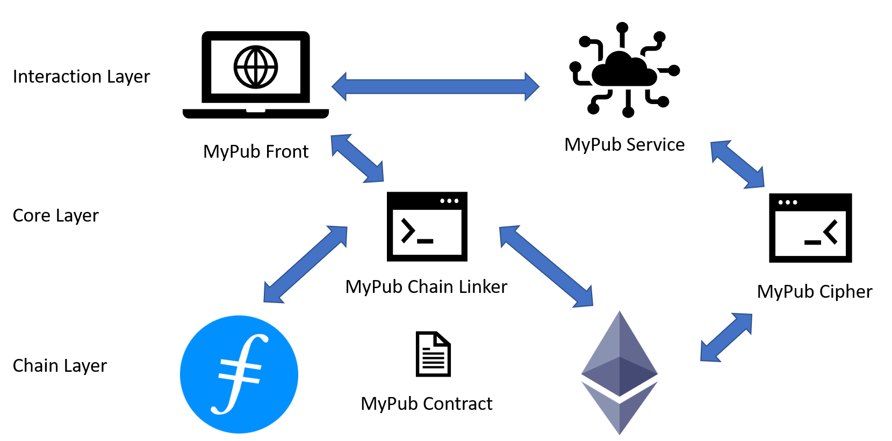

# MyPub

A Decentralized Privacy-Preserving Publishing Platform

## Main Components

* [contracts/](./contracts)
* [ui/](./ui)

## Tech Stack

### Contract

- [Truffle Suite](https://www.trufflesuite.com/)
- [OpenZeppelin](https://openzeppelin.com/contracts/)
- [IPFS Server API Simulator](https://github.com/yepengding/IPFSServerAPISimulator)

### Front-End

- [Front-end README](https://github.com/yepengding/MyPub/tree/main/ui#tech-stack)

## Diagrams

### Architecture

### Sequence Diagrams

