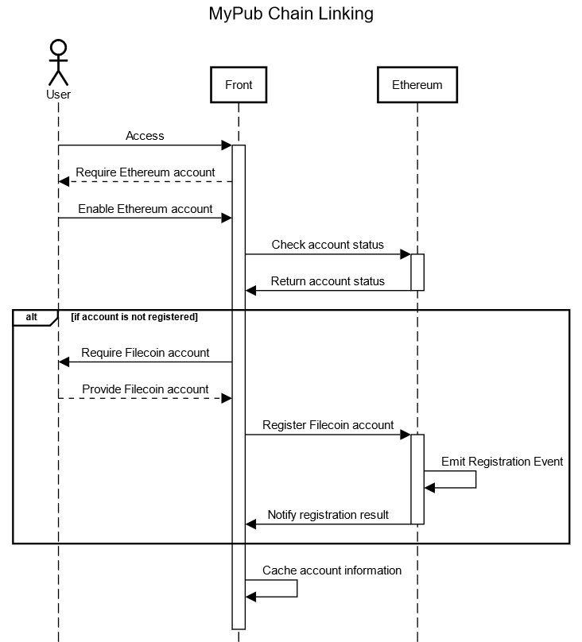
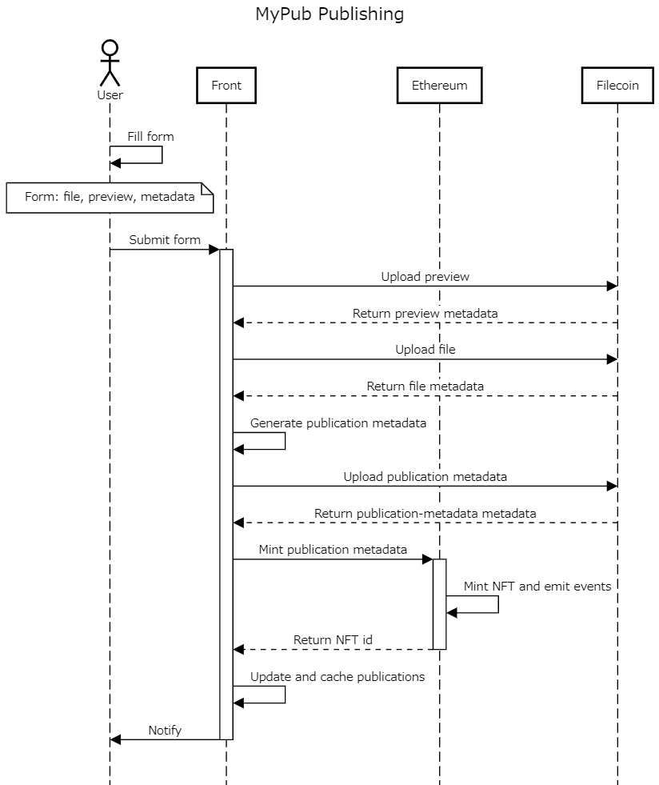
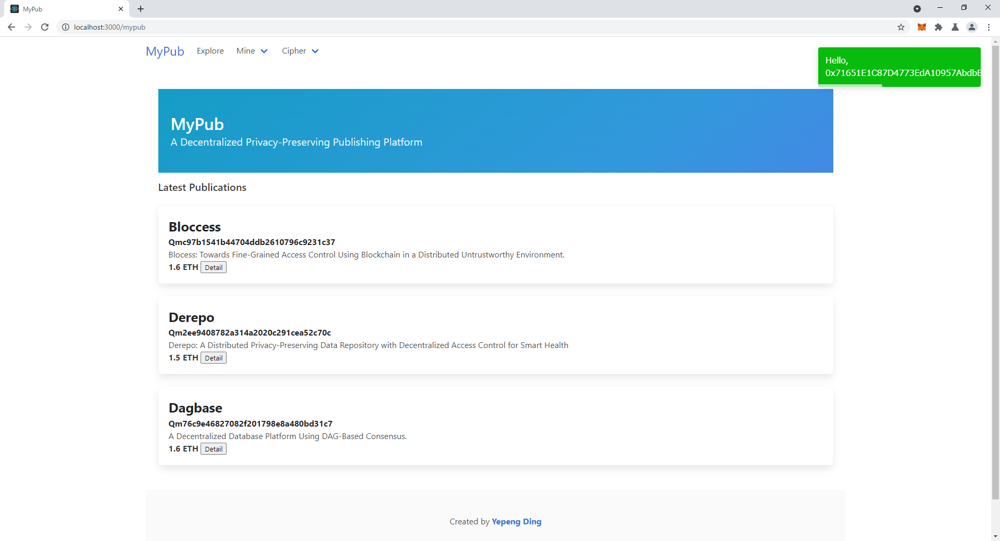
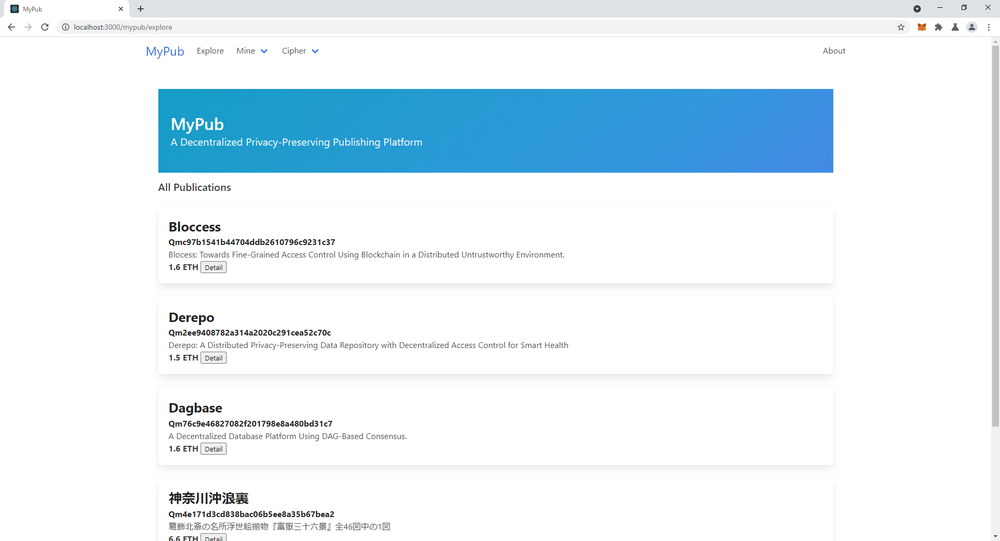
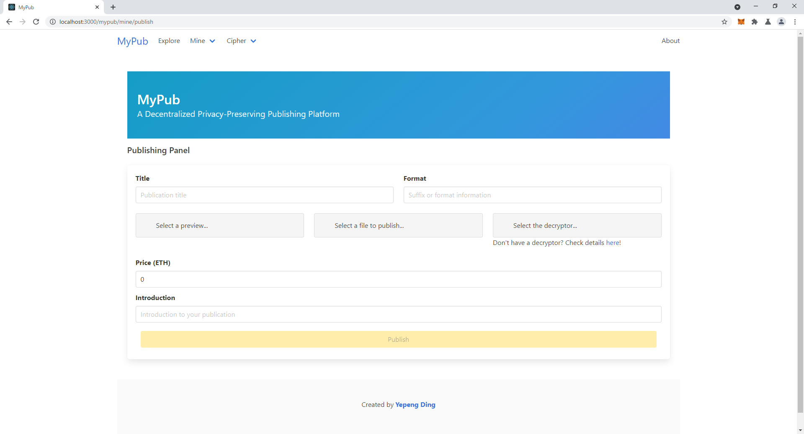
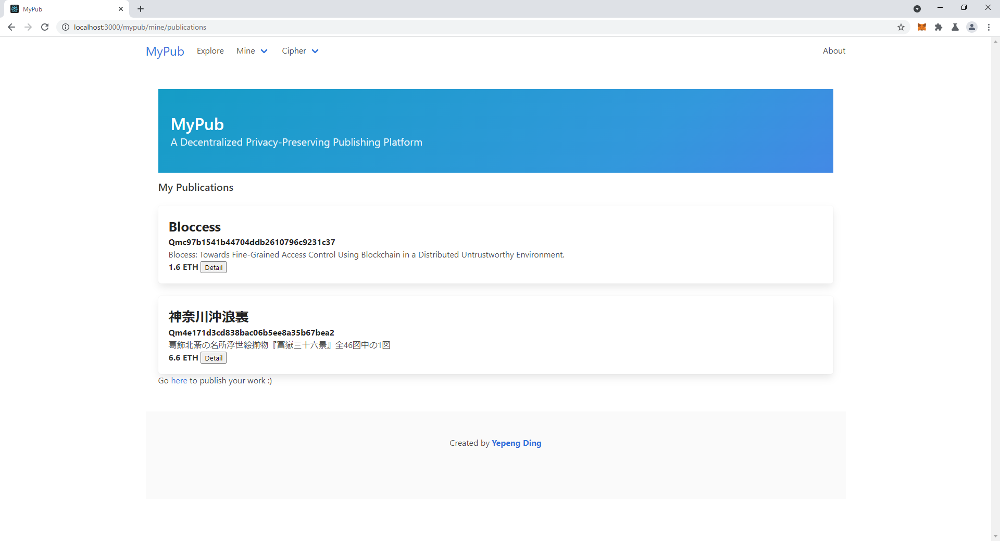
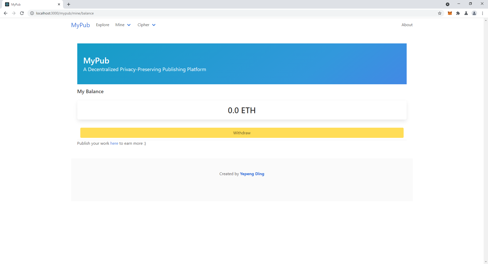
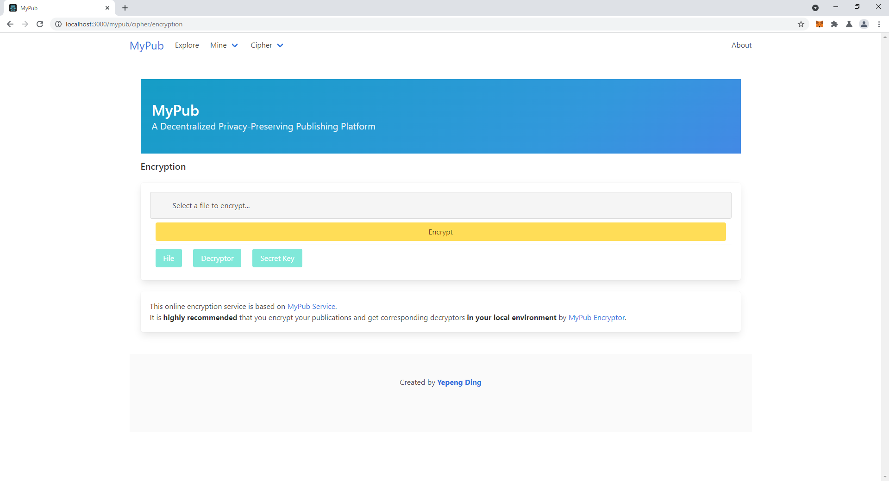

# MyPub

A Decentralized Privacy-Preserving Publishing Platform.

## Slides

* [English](https://github.com/yepengding/MyPub/blob/main/doc/talk/MyPub-en.pdf)
* [Japanese](https://github.com/yepengding/MyPub/blob/main/doc/talk/MyPub-jp.pdf)

### Demo Video
* [Demo video with illustration (in Japanese)](https://youtu.be/iWzx6xJPVAw)
* [Raw demo video](https://youtu.be/BAB9LXLFbzo)

## Components

* [MyPub Front + Chain Linker](https://github.com/yepengding/MyPub/tree/main/ui)
* [MyPub Contract](https://github.com/yepengding/MyPub/tree/main/contracts)
* MyPub Cipher
    - [Encryptor](https://github.com/yepengding/MyPubEncryptor)
    - [Decryptor](https://github.com/yepengding/MyPubDecryptor)
* [MyPub Service](https://github.com/yepengding/MyPubService)

## Local Demo

### Setup

1. Set up local test network (such as [Ganache](https://www.trufflesuite.com/ganache) for Ethereum
   and [IPFSServerAPISimulator](https://github.com/yepengding/IPFSServerAPISimulator) for Filecoin)
2. Configure `truffle-config.js`, `contract/Publication.sol`, compile and
   migrate [MyPub contracts](https://github.com/yepengding/MyPub/tree/main/contracts)
3. Configure `src/config.js` and build [MyPub Front](https://github.com/yepengding/MyPub/tree/main/ui)
4. Configure `src/config.rs` and compile [MyPub Encryptor](https://github.com/yepengding/MyPubEncryptor)
5. Configure `GlobalProperties.java`, initialize workspace with encryptor, and
   build [MyPub Service](https://github.com/yepengding/MyPubService)

## Tech Stack

### Contract

- [Contract README](https://github.com/yepengding/MyPub/tree/main/contracts#tech-stack)

### Front-End

- [Front-end README](https://github.com/yepengding/MyPub/tree/main/ui#tech-stack)

## Diagrams

### Architecture

### Sequence Diagrams

## UI

### Main

### Explore

### Publish

### My Publications

### Balance

### Encryption

